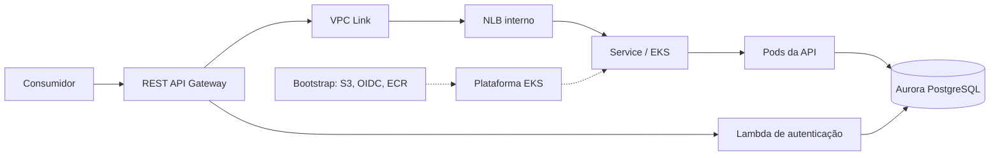

# Infraestrutura do Sistema de Gerenciamento de Mecânica

Mantém a infraestrutura AWS e a plataforma Kubernetes compartilhada pelos componentes da oficina. A API e seu Deployment/HPA ficam no repositório da aplicação; o banco e a função de autenticação têm repositórios próprios.

## Estado da implementação

A base Terraform da Fase 2 foi transferida e integrada. Ela contém VPC/subnets públicas, Internet Gateway, EKS, IAM, Managed Node Group e add-ons. O Service da API continua como `LoadBalancer`, sem a configuração final de NLB interno.

**O bootstrap ECR/S3/OIDC está implementado; rede privada, API Gateway, VPC Link e isolamento dos workloads hom/prd ainda estão pendentes.** A base herdada não representa a implantação final da Fase 3.

## Estrutura e tecnologias

| Caminho | Conteúdo |
|---|---|
| [terraform](terraform) | Recursos AWS e variáveis da base existente |
| [versions.tf](terraform/versions.tf) | Terraform `~> 1.15.0`, provider AWS `~> 6.0` |
| [.terraform.lock.hcl](terraform/.terraform.lock.hcl) | Provider AWS fixado atualmente em 6.58.0 |
| [kubernetes](kubernetes) | Kustomize com apenas o Service da API |
| [Metrics Server opcional](kubernetes/optional/metrics-server.yaml) | Alternativa para clusters sem o add-on; não aplicar ambos |
| [origem-fase2.json](docs/origem-fase2.json) | Proveniência e hashes dos 12 arquivos transferidos |

A base inclui add-ons Metrics Server, Pod Identity Agent e EBS CSI. A necessidade do EBS CSI será revista com a retirada do PostgreSQL do EKS.

## Arquitetura alvo

Este diagrama representa o destino da implementação:



Este repositório manterá Gateway/VPC Link/composição OpenAPI e plataforma; Lambda pertence à autenticação e Aurora ao banco. O AWS Load Balancer Controller solicitará o NLB a partir do Service; Terraform não deverá gerenciar o mesmo NLB em duplicidade.

## Bootstrap persistente

A unidade [bootstrap/](bootstrap/README.md) prepara buckets de estado/artefatos, ECR e dez roles OIDC por componente/ambiente, com testes de plano sem AWS. Está separada do EKS herdado. O bootstrap foi aplicado, a migração do estado para S3 foi confirmada e os testes positivos OIDC foram executados. Permissões de workloads serão acrescentadas junto dos respectivos componentes.

## Pré-requisitos e validação local

Instale Terraform compatível com [versions.tf](terraform/versions.tf), Git e kubectl com Kustomize. O init precisa de rede para baixar o provider. Os comandos abaixo não criam recursos AWS nem aplicam manifestos:

```bash
terraform -chdir=terraform fmt -check -recursive
terraform -chdir=terraform init -backend=false -lockfile=readonly
terraform -chdir=terraform validate
kubectl kustomize kubernetes
```

A renderização Kustomize não exige cluster. `init -backend=false` não configura um backend remoto e não comprova permissões/conectividade AWS. Não há aplicação HTTP para executar neste repositório.

O lockfile inclui checksums para Windows AMD64 (desenvolvimento local) e Linux AMD64 (CI). Ao atualizar providers, gere os checksums de ambas as plataformas e inclua a alteração do lockfile na revisão:

```bash
terraform -chdir=terraform providers lock -platform=windows_amd64 -platform=linux_amd64
```

Mantenha `-lockfile=readonly` no CI para validar as dependências registradas. Referência: [lock de providers para múltiplas plataformas](https://developer.hashicorp.com/terraform/cli/commands/providers/lock).

## Configuração existente

Valores atuais em [variables.tf](terraform/variables.tf):

| Variável | Padrão atual |
|---|---|
| `aws_region` | us-east-1 |
| `cluster_name` | api-cluster |
| `kubernetes_version` | null; versão não fixada |
| `vpc_cidr` | 10.0.0.0/16 |
| `public_subnet_cidrs` | 10.0.1.0/24 e 10.0.2.0/24 |
| `node_instance_types` / `node_capacity_type` | t3.small / ON_DEMAND |
| Nós mínimo / desejado / máximo | 1 / 2 / 3 |

Esses valores são herdados. A arquitetura aceita prevê um nó por ambiente e redes próprias de hom/prd; isso ainda precisa ser aplicado ao Terraform. Os [outputs](terraform/outputs.tf) incluem IDs de rede, nomes/endpoint do EKS e ARNs de roles.

Não versionar credenciais, tfvars preenchidos, planos ou estados. Estados locais anteriores não foram migrados automaticamente: identificar sua relação com recursos existentes antes de um provisionamento.

## CI e deploy

O [workflow de CI](.github/workflows/ci.yml) valida PRs e pushes para `develop`/`main`, além de permitir acionamento manual. Não há filtro por caminhos, para que os checks obrigatórios também sejam emitidos em mudanças de documentação.

- `terraform-validate`: Terraform 1.15.9, formatação, init com backend desabilitado/lockfile somente leitura e validação de terraform/ e bootstrap/; testes de plano do bootstrap com provider AWS simulado.
- `kubernetes-validate`: kubectl 1.36.1 renderiza a composição ativa de `kubernetes/`; não conecta ao cluster nem valida recursos instalados nele.

Os jobs usam apenas leitura do repositório e não precisam de credenciais AWS. Executam apenas planos simulados nos testes do bootstrap; não executam plan contra AWS, apply, deploy ou provisionamento. Após publicar o workflow e confirmar a primeira execução, configurar esses nomes como checks obrigatórios no ruleset. A configuração de proteção não é feita por este workflow.

O bootstrap está provisionado e a autenticação OIDC possui diagnóstico manual. Acesso administrativo ao EKS e permissões efetivas dos workloads ainda precisam de implementação/validação. Rede privada, controller/NLB, observabilidade e unidade Gateway serão implementados antes da entrega final.

A sequência planejada é bootstrap persistente, plataforma/rede/EKS e Service, banco/esquema, API e função, seguida de Gateway e verificações. A inicialização do banco pertence ao repositório de banco. Consulte a [RFC de entrega](https://github.com/pknfelps/GerenciamentoMecanicaSistema/blob/develop/docs/arquitetura/rfcs/002-ENTREGA.md) para contratos e dependências.

## Contratos de integração

A [especificação central](https://github.com/pknfelps/GerenciamentoMecanicaSistema/blob/develop/docs/arquitetura/CONTRATOS_ENTRE_REPOSITORIOS.md) é a fonte dos campos e formatos. Este repositório possui dois produtores: **base** e **gateway**, com estados, roles e namespaces SSM separados. Publicação/consumo dos metadados ainda serão implementados.

| Unidade | Publica | Consome |
|---|---|---|
| Bootstrap persistente | Buckets de estado/artefatos, ECR, OIDC, roles e outputs para Environments | Conta/região e repositórios autorizados |
| Base | /mecanica/<ambiente>/base/v1/: VPC/subnets, cluster/namespace, SGs efetivos, Service/NLB/listener, ECR e referências JWT/observabilidade; release e tentativas | Outputs do bootstrap e configuração operacional por ambiente |
| Gateway | /mecanica/<ambiente>/gateway/v1/: IDs/stage/URL, VPC Link, OpenAPI composto, release e tentativas | Releases de base/API/função e os dois OpenAPI selecionados |

A base mantém Service/controller/NLB e os secrets compartilhados JWT/New Relic. O banco mantém suas credenciais; API mantém SMTP. Secret é compartilhado por referência ARN, não por valor. A API mantém Deployment/HPA; o controller mantém o NLB solicitado pelo Service.

A base publica ready quando cluster/controller/NLB/listener estão disponíveis, sem aguardar pods da API. Gateway aguarda API e função prontas; cria a permissão para invocar a versão Lambda publicada e compõe o OpenAPI em contracts/gateway/<ambiente>/<deploymentId>/openapi.json, com checksum. Não usa uma cópia manual divergente dos contratos dos backends.

O workflow reutilizável do Gateway pertence a este repositório e será fixado por SHA. Quando API/auth o chamarem, assume a role gateway com o OIDC do chamador. Esse caminho ainda precisa de teste específico; o [diagnóstico manual](.github/workflows/aws-oidc-check.yml) testa base/gateway a partir deste repositório.

Entradas de Environment: AWS_REGION, AWS_BASE_ROLE_ARN, AWS_GATEWAY_ROLE_ARN, TF_STATE_BUCKET e ARTIFACTS_BUCKET. Backend/bootstrap é persistente; descarte de hom/prd preserva esses recursos. Concorrência entre repositórios ainda exige coordenação antes de habilitar mutações simultâneas do mesmo ambiente; lock Terraform e concurrency local não substituem essa coordenação.

## Desenvolvimento e ambientes

Todo trabalho parte da `develop` atualizada, em branch de tarefa e PR para `develop`. Promover `develop -> main` somente com a entrega concluída. A arquitetura prevê **hom** para develop e **prd** para main, coexistindo com recursos e estados separados; a configuração atual ainda não oferece esse isolamento.

## APIs e referências

Este componente não oferece endpoints de negócio; manterá a entrada da API e da função. O endereço público e o OpenAPI composto ainda não foram publicados.

- [Aplicação](https://github.com/pknfelps/GerenciamentoMecanicaSistema/tree/develop) e [contrato de acesso](https://github.com/pknfelps/GerenciamentoMecanicaSistema/blob/develop/docs/arquitetura/ACESSO_E_AUTENTICACAO.md).
- [Arquitetura AWS](https://github.com/pknfelps/GerenciamentoMecanicaSistema/blob/develop/docs/arquitetura/diagramas/COMPONENTES.md).
- [Banco](https://github.com/pknfelps/GerenciamentoMecanicaBancoDados/tree/develop).
- [Autenticação](https://github.com/pknfelps/GerenciamentoMecanicaAutenticacao/tree/develop).
