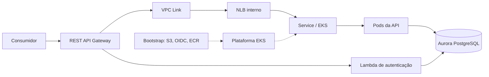

# Infraestrutura do Sistema de Gerenciamento de Mecânica

Mantém a infraestrutura AWS e a plataforma Kubernetes compartilhada pelos componentes da oficina. A API e seu Deployment/HPA ficam no repositório da aplicação; o banco e a função de autenticação têm repositórios próprios.

## Estado da implementação

A base Terraform possui redes hom/prd, subnets públicas de suporte, privadas de workloads e isoladas de banco, NAT zonal/Elastic IP, endpoint S3, EKS em subnets privadas, IAM e add-ons. Cada ambiente está configurado com um nó t3.small On-Demand. O Service da API continua como `LoadBalancer`, sem a configuração final de NLB interno.

**Bootstrap e backends confirmados; base hom provisionada manualmente e acesso do operador validado. Permissões e workflows das pipelines estão implementados e testados localmente; aplicação das novas policies/access entries e execução remota ainda pendentes.** API Gateway, VPC Link, controller/NLB e integração dos workloads ainda precisam ser implementados.

## Estrutura e tecnologias

| Caminho | Conteúdo |
|---|---|
| [terraform](terraform) | Recursos AWS e variáveis da base existente |
| [versions.tf](terraform/versions.tf) | Terraform `~> 1.15.0`, provider AWS `~> 6.0` |
| [.terraform.lock.hcl](terraform/.terraform.lock.hcl) | Provider AWS fixado atualmente em 6.58.0 |
| [kubernetes](kubernetes) | Kustomize com apenas o Service da API |
| [Metrics Server opcional](kubernetes/optional/metrics-server.yaml) | Alternativa para clusters sem o add-on; não aplicar ambos |
| [origem-fase2.json](docs/origem-fase2.json) | Proveniência e hashes dos 12 arquivos transferidos |

A base inclui add-ons Metrics Server, Pod Identity Agent e EBS CSI. A necessidade do EBS CSI será revista com a retirada do PostgreSQL do EKS.

## Arquitetura alvo

Este diagrama representa o destino da implementação:


```mermaid
flowchart LR
    CLIENT["Consumidor"] --> GW["REST API Gateway"]
    GW --> LINK["VPC Link"]
    LINK --> NLB["NLB interno"]
    NLB --> SERVICE["Service / EKS"]
    SERVICE --> PODS["Pods da API"]
    GW --> LAMBDA["Lambda de autenticação"]
    PODS --> DB[("Aurora PostgreSQL")]
    LAMBDA --> DB
    BOOT["Bootstrap: S3, OIDC, ECR"] -.-> EKS["Plataforma EKS"]
    EKS -.-> SERVICE
```

Este repositório manterá Gateway/VPC Link/composição OpenAPI e plataforma; Lambda pertence à autenticação e Aurora ao banco. O AWS Load Balancer Controller solicitará o NLB a partir do Service; Terraform não deverá gerenciar o mesmo NLB em duplicidade.

## Bootstrap persistente

A unidade [bootstrap/](bootstrap/README.md) prepara buckets de estado/artefatos, ECR e dez roles OIDC por componente/ambiente, com testes de plano sem AWS. Está separada do EKS herdado. O bootstrap foi aplicado, a migração do estado para S3 foi confirmada e os testes positivos OIDC foram executados. Permissões de workloads serão acrescentadas junto dos respectivos componentes.

## Pipelines de provisionamento e diagnóstico

[Procedimento completo](docs/PIPELINES_BASE.md): aplicar primeiro as novas permissões do bootstrap com identidade administrativa; depois executar base-provision com action=activate em develop/hom e aprovar o resumo em Review deployments. Plan, aprovação e apply ocorrem na mesma execução, com commit/fingerprint conferidos automaticamente. PRs validam sem AWS. O workflow usa OIDC, backends hom/prd, CI prévio e recusa exclusões/substituições. Push em develop/main atualiza somente bases já existentes; ativação de ambiente ausente exige execução manual revisada. Infra/API/banco possuem check_kubernetes opcional no aws-oidc-check, usando a identidade real de cada pipeline.

O hom existente mantém bootstrap administrativo true para evitar substituição; prd e clusters novos usam false e entries explícitas. Após descartar hom, ajustar explicitamente seu arquivo para false antes de recriar. Policies completas: bootstrap/base-permissions.tf; acesso Kubernetes: terraform/pipeline-access.tf. Sem deploy da API/Aurora/Gateway neste passo.

## Pré-requisitos e validação local

Instale Terraform compatível com [versions.tf](terraform/versions.tf), Git e kubectl com Kustomize. O init precisa de rede para baixar o provider. Os comandos abaixo não criam recursos AWS nem aplicam manifestos:

```bash
terraform -chdir=terraform fmt -check -recursive
terraform -chdir=terraform init -backend=false -lockfile=readonly
terraform -chdir=terraform validate
kubectl kustomize kubernetes
```

A renderização Kustomize não exige cluster. `init -backend=false` não configura um backend remoto e não comprova permissões/conectividade AWS. Não há aplicação HTTP para executar neste repositório.

O lockfile inclui checksums para Windows AMD64 (desenvolvimento local) e Linux AMD64 (CI). Ao atualizar providers, gere os checksums de ambas as plataformas e inclua a alteração do lockfile na revisão:

```bash
terraform -chdir=terraform providers lock -platform=windows_amd64 -platform=linux_amd64
```

Mantenha `-lockfile=readonly` no CI para validar as dependências registradas. Referência: [lock de providers para múltiplas plataformas](https://developer.hashicorp.com/terraform/cli/commands/providers/lock).

## Configuração existente

Valores atuais em [variables.tf](terraform/variables.tf):

| Variável | Padrão atual |
|---|---|
| `environment` | Obrigatória, sem padrão; aceita somente hom ou prd |
| `aws_region` | us-east-1 |
| Nome do cluster (calculado, não é variável) | mecanica-hom-eks ou mecanica-prd-eks |
| `kubernetes_version` | Obrigatória, sem padrão; 1.36 nos arquivos hom/prd |
| `vpc_cidr` | Obrigatória, IPv4 /16; hom=10.0.0.0/16, prd=10.1.0.0/16 nos arquivos por ambiente |
| Subnets (calculadas) | /24 derivadas da VPC: públicas 1/2, workloads 11/12, banco 21/22 |
| `node_instance_types` / `node_capacity_type` | t3.small / ON_DEMAND |
| Nós mínimo / desejado / máximo | 1 / 1 / 1 |

Os arquivos por ambiente fixam rede, capacidade e Kubernetes 1.36. Os [outputs](terraform/outputs.tf) incluem subnets públicas/workloads/banco, tabelas de rotas, NAT/EIP/endpoint S3, nomes/endpoint do EKS e ARNs de roles. Subnets de banco são publicadas para o repositório do Aurora; nenhuma instância de banco é criada aqui.

A identificação do ambiente é obrigatória em operações como plan/apply: informe `-var="environment=hom"` ou `-var="environment=prd"`, ou configure `environment` no arquivo local de variáveis usando [terraform.tfvars.example](terraform/terraform.tfvars.example) como referência. Use `-input=false` nas execuções automatizadas para falhar quando uma variável obrigatória estiver ausente. `terraform validate` verifica a configuração sem exigir os valores de execução.

O [locals.tf](terraform/locals.tf) deriva o prefixo mecanica-<ambiente> e o cluster mecanica-<ambiente>-eks. Node group, roles IAM (incluindo EBS CSI) e tags Name da rede usam essa identificação. As tags padrão Project=mecanica, Environment=<ambiente> e ManagedBy=Terraform prevalecem sobre var.tags; demais tags adicionais são preservadas. O output cluster_name continua disponível, mas a variável de entrada cluster_name foi removida: retire-a de arquivos tfvars e argumentos antigos.

O seletor descrito abaixo associa os parâmetros de cada ambiente ao respectivo backend S3. Redes e nomes são separados na configuração; a comprovação remota de coexistência continua pendente. Para recursos existentes, a alteração dos nomes pode provocar substituições; revisar o plan antes de qualquer apply. Consumidores devem usar o output cluster_name em vez de um nome fixo.

Versionar somente os parâmetros públicos de terraform/environments/hom.tfvars e prd.tfvars. Credenciais, demais tfvars locais, planos e estados permanecem ignorados. Estados locais anteriores não foram migrados automaticamente: identificar sua relação com recursos existentes antes de um provisionamento.

## Seleção de ambiente e estado da base

Use PowerShell 7 e Terraform no PATH. O [seletor](scripts/Invoke-TerraformEnvironment.ps1) associa automaticamente o arquivo de parâmetros ao backend; os caminhos são resolvidos a partir do script, independentemente do diretório atual.

| Ambiente | Parâmetros públicos | Backend | Estado no bucket compartilhado |
|---|---|---|---|
| hom | terraform/environments/hom.tfvars | terraform/backends/hom.hcl | hom/base/terraform.tfstate |
| prd | terraform/environments/prd.tfvars | terraform/backends/prd.hcl | prd/base/terraform.tfstate |

O bucket existente é mecanica-tfstate-121754142617-us-east-1. Ambos os backends exigem a conta 121754142617, região us-east-1, encrypt=true e use_lockfile=true. O workspace é sempre default; a separação ocorre pelas chaves. O bootstrap continua em shared/bootstrap/terraform.tfstate e não é gerenciado por este script.

```powershell
# Apenas mostra a seleção; não executa Terraform nem conecta à AWS.
./scripts/Invoke-TerraformEnvironment.ps1 -Environment hom
./scripts/Invoke-TerraformEnvironment.ps1 -Environment prd

# Validação local: init sem backend e validate; pode baixar providers.
./scripts/Invoke-TerraformEnvironment.ps1 -Environment hom -Action Validate
./scripts/Invoke-TerraformEnvironment.ps1 -Environment prd -Action Validate

# Quando for autorizada a conexão remota, com AWS CLI/SDK autenticado:
./scripts/Invoke-TerraformEnvironment.ps1 -Environment hom -Action Init
./scripts/Invoke-TerraformEnvironment.ps1 -Environment hom -Action Plan
```

Plan inicializa o backend selecionado antes de planejar; basta trocar hom por prd para usar o outro ambiente. Esta versão do script oferece Show, Validate, Init e Plan; apply/destroy e salvamento/aplicação de planos serão integrados ao fluxo de provisionamento. Nenhuma ação faz apply, destroy, migração automática ou reconfigure.

TF_DATA_DIR fica em artifacts/terraform/<ambiente>/remote; a validação sem backend usa artifacts/terraform/<ambiente>/validation. Assim, validação e operações remotas não reutilizam metadados de backend. O script restaura TF_DATA_DIR, TF_WORKSPACE e TF_INPUT ao terminar, inclusive em falhas. Comandos Terraform manuais posteriores não herdam essa seleção.

O seletor recusa pares de arquivos incompatíveis, TF_CLI_ARGS*, workspace diferente de default, estados locais anteriores e tfvars carregados automaticamente na raiz (estes dois últimos antes de Init/Plan). Se houver estado antigo, revisar os recursos administrados e executar uma migração explícita antes de continuar; não apagá-lo para contornar a proteção. Em 2026-09-28 não foram encontrados arquivos de estado local na unidade terraform; isso não comprova ausência de recursos ou estados remotos.

Os arquivos públicos informam environment, região, versão Kubernetes, VPC /16 e capacidade de um nó. Init dos backends hom/prd e seus metadados foram confirmados pelo mantenedor; locking concorrente e planos reais da base ainda precisam ser validados. As roles do bootstrap ainda dependem das permissões dos workloads para o provisionamento completo.

```powershell
# Testa a seleção com Terraform simulado, sem chamadas AWS.
pwsh -NoProfile -File scripts/tests/Test-TerraformEnvironment.ps1
```

Referências: [backend S3](https://developer.hashicorp.com/terraform/language/backend/s3) e [TF_DATA_DIR](https://developer.hashicorp.com/terraform/cli/config/environment-variables#tf_data_dir).

## Rede e capacidade por ambiente

| Camada | hom | prd | Roteamento |
|---|---|---|---|
| VPC | 10.0.0.0/16 | 10.1.0.0/16 | Sem conexão entre ambientes |
| Públicas | 10.0.1.0/24, 10.0.2.0/24 | 10.1.1.0/24, 10.1.2.0/24 | Internet Gateway; suporte ao NAT |
| Workloads | 10.0.11.0/24, 10.0.12.0/24 | 10.1.11.0/24, 10.1.12.0/24 | Saída pelo NAT e gateway endpoint S3 |
| Banco | 10.0.21.0/24, 10.0.22.0/24 | 10.1.21.0/24, 10.1.22.0/24 | Somente rede local da VPC |

Cada camada ocupa as mesmas duas primeiras AZs elegíveis, preservando a exclusão de use1-az3 exigida pelo EKS. CIDRs são derivados de vpc_cidr para evitar sobreposição interna. A entrada public_subnet_cidrs foi removida; retirar esse campo de tfvars antigos e usar os arquivos por ambiente.

Subnets não atribuem IP público automaticamente. EKS e node group usam somente as subnets de workloads, que recebem a tag internal-elb para a futura descoberta do NLB interno. As subnets de suporte/banco não recebem tags para descoberta de load balancer público. O endpoint administrativo EKS é público e privado: nós usam o caminho privado; runners externos usam a API pública autenticada. As access entries das roles base/API/banco estão declaradas em pipeline-access.tf; aplicação e validação real dos runners continuam pendentes.

Cada ambiente administra um NAT zonal na primeira subnet pública e seu Elastic IP no próprio estado. As rotas dos workloads dependem dele; a tabela do banco não contém rota padrão nem associação ao endpoint S3. NAT/EIP são destruídos com a base após seus dependentes, preservando o bootstrap; o descarte completo ainda precisa coordenar workloads, banco e NLB antes da base.

O gateway endpoint S3 está associado somente à tabela dos workloads, para acesso a S3/camadas ECR sem NAT. APIs ECR, Secrets Manager e saída externa continuam pelo NAT. Security groups/conectividade do Aurora serão implementados com o banco; as subnets isoladas não substituem essas regras.

Um nó t3.small On-Demand por cluster (mínimo/desejado/máximo 1) é a capacidade normal. Esse tipo tem 2 vCPUs e 2 GiB de memória; foi escolhido após a EC2 recusar t3.medium por elegibilidade ao Free Tier. Confirmar a saúde dos add-ons e a capacidade disponível para API/observabilidade após o provisionamento. Duas AZs de subnets não tornam um nó ou um NAT altamente disponíveis; atualizações do managed node group podem gerar capacidade transitória. HPA e probes da API não foram alterados. Funcionamento dos add-ons e capacidade com observabilidade ainda exigem validação no cluster antes da apresentação.

Validação sem AWS, usando os próprios parâmetros versionados:

```powershell
terraform -chdir=terraform test -var-file=environments/hom.tfvars
terraform -chdir=terraform test -var-file=environments/prd.tfvars
```

Referências: [rede EKS](https://docs.aws.amazon.com/eks/latest/userguide/network-reqs.html), [NAT Gateway](https://docs.aws.amazon.com/vpc/latest/userguide/vpc-nat-gateway.html) e [gateway endpoint S3](https://docs.aws.amazon.com/vpc/latest/privatelink/vpc-endpoints-s3.html).

## Versão do Kubernetes

Os arquivos hom/prd e o exemplo fixam Kubernetes **1.36**. A variável é obrigatória e aceita uma versão minor (1.N); o Managed Node Group referencia a versão do cluster. O EKS gerencia patches e versões de plataforma, portanto esta configuração não fixa um patch como 1.36.4.

Em 2026-09-28, consultas somente de leitura à API EKS em us-east-1 confirmaram 1.36 em STANDARD_SUPPORT, com término do suporte padrão em **2027-08-02 (UTC)**. Também confirmaram versões compatíveis de Pod Identity Agent, EBS CSI e Metrics Server. Os add-ons continuam com seleção padrão do EKS; esta consulta verifica disponibilidade, não funcionamento no cluster. O kubectl 1.36.1 do CI permanece alinhado à mesma versão minor.

Revisar a versão antes de novas janelas de implantação e antes do fim do suporte padrão. A fixação não impede as políticas de ciclo de vida do EKS; esta alteração não modifica a política de suporte do serviço. Para atualizações futuras, validar primeiro em hom, verificar compatibilidade dos add-ons e revisar o plan antes de promover a prd.

Referência: [versões e calendário de suporte do Amazon EKS](https://docs.aws.amazon.com/eks/latest/userguide/kubernetes-versions.html).

## Acesso administrativo do operador

[eks-access.tf](terraform/eks-access.tf) consulta o usuário IAM existente mecanica e registra uma access entry STANDARD no cluster de cada ambiente, associada à AmazonEKSClusterAdminPolicy com escopo cluster. Esse operador administra os recursos Kubernetes de todo o cluster. O Terraform não cria o usuário nem gerencia suas credenciais/policies IAM.

O cluster usa API_AND_CONFIG_MAP: habilita access entries e mantém o mecanismo aws-auth existente. A migração ocorre em lugar, sem recriar o EKS. Depois de habilitar a API, não é possível retornar ao modo exclusivamente CONFIG_MAP. O acesso das roles base/API/banco está declarado separadamente em pipeline-access.tf; ver docs/PIPELINES_BASE.md para ativação e validação.

Após aplicar o plano, configure um perfil AWS autenticado como mecanica e confirme sua identidade antes de usar kubectl:

~~~powershell
# Executar com um perfil mecanica já autenticado.
aws sts get-caller-identity --profile mecanica
# O ARN deve ser arn:aws:iam::121754142617:user/mecanica.
aws eks update-kubeconfig --name mecanica-hom-eks --region us-east-1 --profile mecanica --alias mecanica-hom
kubectl --context mecanica-hom auth can-i get nodes
kubectl --context mecanica-hom get nodes
kubectl --context mecanica-hom get pods -A
~~~

Trocar o nome do perfil não autentica o usuário automaticamente. Para prd, usar mecanica-prd-eks/contexto mecanica-prd após seu provisionamento. Não validar esse acesso usando uma sessão root ou impersonação kubectl --as; o teste precisa usar a identidade do operador.

Referências: [modo de autenticação EKS](https://docs.aws.amazon.com/eks/latest/userguide/setting-up-access-entries.html) e [AmazonEKSClusterAdminPolicy](https://docs.aws.amazon.com/eks/latest/userguide/access-policy-permissions.html#access-policy-permissions-amazoneksclusteradminpolicy).

## CI e deploy

O [workflow de CI](.github/workflows/ci.yml) valida PRs e pushes para `develop`/`main`, além de permitir acionamento manual. Não há filtro por caminhos, para que os checks obrigatórios também sejam emitidos em mudanças de documentação.

- `terraform-validate`: Terraform 1.15.9, formatação, init com backend desabilitado/lockfile somente leitura e validação de terraform/ e bootstrap/; testes de plano do bootstrap, testes completos de rede/capacidade com provider AWS simulado para cada arquivo de ambiente e testes offline do seletor de ambientes.
- `kubernetes-validate`: kubectl 1.36.1 renderiza a composição ativa de `kubernetes/`; não conecta ao cluster nem valida recursos instalados nele.

Os jobs usam apenas leitura do repositório e não precisam de credenciais AWS. Os testes de rede executam plan/apply/teardown exclusivamente no provider AWS simulado para conferir os IDs e vínculos; nenhum recurso real é criado. Não executam plan/apply contra AWS, deploy ou provisionamento. Após publicar o workflow e confirmar a primeira execução, configurar esses nomes como checks obrigatórios no ruleset. A configuração de proteção não é feita por este workflow.

O bootstrap está provisionado e a autenticação OIDC possui diagnóstico manual. Acesso administrativo de mecanica está declarado no Terraform; aplicação e validação com essa identidade permanecem pendentes. Acesso das pipelines e permissões efetivas dos workloads ainda precisam de implementação/validação. Rede privada está configurada e validada por simulação; controller/NLB, observabilidade e unidade Gateway serão implementados antes da entrega final.

A sequência planejada é bootstrap persistente, plataforma/rede/EKS e Service, banco/esquema, API e função, seguida de Gateway e verificações. A inicialização do banco pertence ao repositório de banco. Consulte a [RFC de entrega](https://github.com/pknfelps/GerenciamentoMecanicaSistema/blob/develop/docs/arquitetura/rfcs/002-ENTREGA.md) para contratos e dependências.

## Contratos de integração

A [especificação central](https://github.com/pknfelps/GerenciamentoMecanicaSistema/blob/develop/docs/arquitetura/CONTRATOS_ENTRE_REPOSITORIOS.md) é a fonte dos campos e formatos. Este repositório possui dois produtores: **base** e **gateway**, com estados, roles e namespaces SSM separados. Publicação/consumo dos metadados ainda serão implementados.

| Unidade | Publica | Consome |
|---|---|---|
| Bootstrap persistente | Buckets de estado/artefatos, ECR, OIDC, roles e outputs para Environments | Conta/região e repositórios autorizados |
| Base | /mecanica/<ambiente>/base/v1/: VPC/subnets, cluster/namespace, SGs efetivos, Service/NLB/listener, ECR e referências JWT/observabilidade; release e tentativas | Outputs do bootstrap e configuração operacional por ambiente |
| Gateway | /mecanica/<ambiente>/gateway/v1/: IDs/stage/URL, VPC Link, OpenAPI composto, release e tentativas | Releases de base/API/função e os dois OpenAPI selecionados |

A base mantém Service/controller/NLB e os secrets compartilhados JWT/New Relic. O banco mantém suas credenciais; API mantém SMTP. Secret é compartilhado por referência ARN, não por valor. A API mantém Deployment/HPA; o controller mantém o NLB solicitado pelo Service.

A base publica ready quando cluster/controller/NLB/listener estão disponíveis, sem aguardar pods da API. Gateway aguarda API e função prontas; cria a permissão para invocar a versão Lambda publicada e compõe o OpenAPI em contracts/gateway/<ambiente>/<deploymentId>/openapi.json, com checksum. Não usa uma cópia manual divergente dos contratos dos backends.

O workflow reutilizável do Gateway pertence a este repositório e será fixado por SHA. Quando API/auth o chamarem, assume a role gateway com o OIDC do chamador. Esse caminho ainda precisa de teste específico; o [diagnóstico manual](.github/workflows/aws-oidc-check.yml) testa base/gateway a partir deste repositório.

Entradas de Environment: AWS_REGION, AWS_BASE_ROLE_ARN, AWS_GATEWAY_ROLE_ARN, TF_STATE_BUCKET e ARTIFACTS_BUCKET. Backend/bootstrap é persistente; descarte de hom/prd preserva esses recursos. Concorrência entre repositórios ainda exige coordenação antes de habilitar mutações simultâneas do mesmo ambiente; lock Terraform e concurrency local não substituem essa coordenação.

## Desenvolvimento e ambientes

Todo trabalho parte da `develop` atualizada, em branch de tarefa e PR para `develop`. Promover `develop -> main` somente com a entrega concluída. A arquitetura prevê **hom** para develop e **prd** para main, coexistindo com recursos e estados separados; seleção de estados, redes privadas e capacidade estão configuradas. Coexistência, conectividade e descarte independente ainda precisam ser comprovados em nuvem.

## APIs e referências

Este componente não oferece endpoints de negócio; manterá a entrada da API e da função. O endereço público e o OpenAPI composto ainda não foram publicados.

- [Aplicação](https://github.com/pknfelps/GerenciamentoMecanicaSistema/tree/develop) e [contrato de acesso](https://github.com/pknfelps/GerenciamentoMecanicaSistema/blob/develop/docs/arquitetura/ACESSO_E_AUTENTICACAO.md).
- [Arquitetura AWS](https://github.com/pknfelps/GerenciamentoMecanicaSistema/blob/develop/docs/arquitetura/diagramas/COMPONENTES.md).
- [Banco](https://github.com/pknfelps/GerenciamentoMecanicaBancoDados/tree/develop).
- [Autenticação](https://github.com/pknfelps/GerenciamentoMecanicaAutenticacao/tree/develop).


### Descarte manual da base

`base-destroy` executa CI, plano de exclusão, aprovação em Review deployments e descarte verificado na mesma execução. Selecionar develop/hom ou main/prd e action=destroy; action=plan somente consulta. Preserva bootstrap/backend/OIDC e outro ambiente, usando as mesmas roles e environments de aprovação do provisionamento. O novo workflow precisa estar publicado em main para disponibilizar Run workflow. [Operação e validação do ciclo completo](docs/PIPELINES_BASE.md).


### Gatilhos de CI

O CI automático valida PRs destinados a develop/main, sem uma segunda execução por push. Novos commits cancelam os checks antigos do mesmo PR; execução manual continua disponível. Os nomes dos jobs/checks foram preservados.

base-provision mantém push em develop/main e chama o CI reutilizável antes de planejar/aplicar o commit implantado; base-destroy continua manual. Essa validação do provisionamento tem concorrência separada dos checks de PR e não é cancelada por eles.
